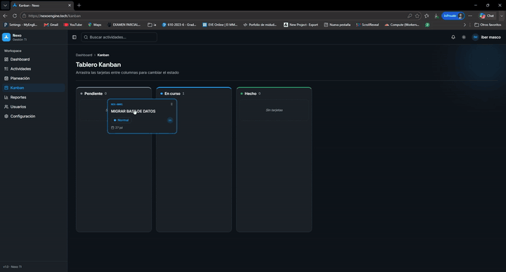

# Nexo

[](https://github.com/IBER-DEV/nexo/actions/workflows/ci.yml)
[](LICENSE)

> Nexo is an open-source activity management platform for IT teams — backlog, weekly/monthly
> planning, Kanban, and per-organization configurable workflows. Docs and UI are in Spanish;
> that's a product decision (Spanish-first), not an accident.



**¿Solo quieres verlo?** → [nexoengine.tech](https://nexoengine.tech) — landing con demo
interactiva, sin instalar nada.

Plataforma open source de gestión de actividades para equipos de TI: backlog, planeación
semanal/mensual, tablero Kanban y reportes. Cada organización define su propio flujo (estados,
prioridades, tipos) desde una plantilla al registrarse — `ti_clasico`, `kanban_simple` o
`mesa_ayuda` — y lo ajusta sin tocar código. El registro es self-service; para sumar gente a una
organización existente, quien la administra genera **códigos de acceso** (sin invitaciones por
correo).

## Stack

- **Frontend**: React 19 + TanStack Start + TanStack Router/Query + Tailwind CSS v4 +
  shadcn/ui. Despliega como Cloudflare Worker (`wrangler.jsonc`).
- **Backend**: Django 5 + Django REST Framework + JWT (SimpleJWT). PostgreSQL en producción,
  SQLite en desarrollo local.
- **Sync opcional**: integración con Google Sheets/AppSheet para mantener actividades
  sincronizadas en ambas direcciones.

## Requisitos

- Node.js 20+ y npm
- Python 3.12
- Docker + Docker Compose (opcional, para levantar el backend containerizado)

## Desarrollo local

### Frontend

```bash
npm install
cp .env.example .env.local   # ajustar VITE_API_URL si hace falta
npm run dev
```

Corre en `http://localhost:8080` (o el puerto que indique Vite).

### Backend

**Opción A — nativo:**

```bash
cd backend
python -m venv .venv
source .venv/bin/activate
pip install -r requirements.txt
cp .env.example .env
python manage.py migrate
python manage.py seed_data   # usuarios y actividades de prueba
python manage.py runserver
```

**Opción B — Docker (Postgres real, sin instalar Python):**

```bash
docker compose up --build
```

Levanta Postgres + Django en `http://localhost:8000`, con recarga automática al editar
archivos `.py`. Ver `docker-compose.yml` y `backend/Dockerfile`.

> El frontend siempre corre nativo (`npm run dev`) y despliega a Cloudflare Workers — Docker
> cubre únicamente el backend.

### Credenciales de prueba

`seed_data` crea **dos organizaciones** para poder probar aislamiento multi-tenant a mano —
cada una con su propio flujo, prefijo de actividad y usuarios:

```
# org "demo" (prefijo ACT, flujo "TI clásico" de 6 estados)
admin@empresa.com / demo1234        (administrador)
ana.garcia@empresa.com / demo1234   (coordinador)

# org "acme" (prefijo ACM, flujo propio de 4 estados)
admin@acme.com / demo1234           (administrador)
```

Entra con ambas para ver que el Kanban, los selects de estado/prioridad y la numeración de
actividades son realmente dinámicos por organización, no un flujo fijo con etiquetas distintas.

## Scripts

| Comando | Descripción |
|---|---|
| `npm run dev` | Servidor de desarrollo del frontend |
| `npm run build` | Build de producción (Cloudflare Worker) |
| `npm run lint` | ESLint |
| `npm run format` | Prettier |
| `python manage.py sync_appsheet --dry-run` | Simula la sincronización con AppSheet sin escribir cambios |

## Variables de entorno

- **Frontend** (`.env.local`): ver `.env.example`.
- **Backend** (`backend/.env`): ver `backend/.env.example` — incluye configuración de base de
  datos, CORS y las credenciales opcionales de Google Sheets/AppSheet.

## Estructura

```
src/                  Frontend (rutas, componentes, providers, servicios)
backend/apps/         Apps Django (organizations, activities, users, notifications)
backend/config/       Settings (dev / docker / prod), URLs
docker-compose.yml    Backend + Postgres para desarrollo local
```

## Estado del proyecto

Fase 1 (fundaciones SaaS) en progreso — construida en público, ~60% del esfuerzo total de la
estrategia:

- [x] Multi-tenancy + maestros configurables por organización
- [x] Plantillas de flujo al crear una organización (`ti_clasico` / `kanban_simple` /
      `mesa_ayuda`)
- [x] Registro self-service (organización + primer usuario, auto-login)
- [x] Códigos de acceso para incorporar miembros a una organización existente
- [ ] Catálogos genéricos / campos personalizados (deuda consciente, sin caso de cliente real)
- [ ] Billing (Stripe)
- [ ] Hosting del backend en producción

Detalle completo en [docs/roadmap/release-plan.md](docs/roadmap/release-plan.md).

## Documentación

- [CLAUDE.md](CLAUDE.md) — contexto técnico, decisiones de arquitectura y gotchas conocidos.
- [docs/ROADMAP.md](docs/ROADMAP.md) — estrategia open core y fases del producto (Community
  / Cloud / Enterprise).

## Contribuir

Las contribuciones son bienvenidas — lee la [guía de contribución](CONTRIBUTING.md) y el
[código de conducta](CODE_OF_CONDUCT.md). El CI ejecuta lint, typecheck, build y las
pruebas del backend en cada pull request.

## Licencia

Nexo se distribuye bajo la licencia [AGPL-3.0](LICENSE). Puedes usarlo, modificarlo y
auto-alojarlo libremente; si lo ofreces como servicio con modificaciones, debes publicar
esas modificaciones bajo la misma licencia.
